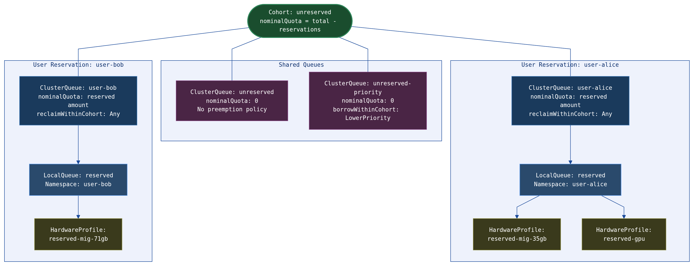
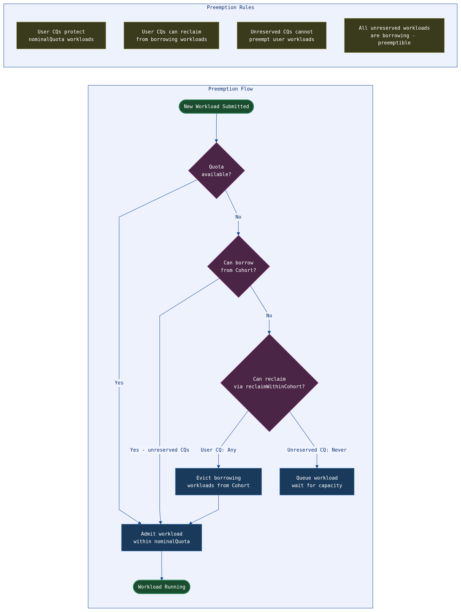
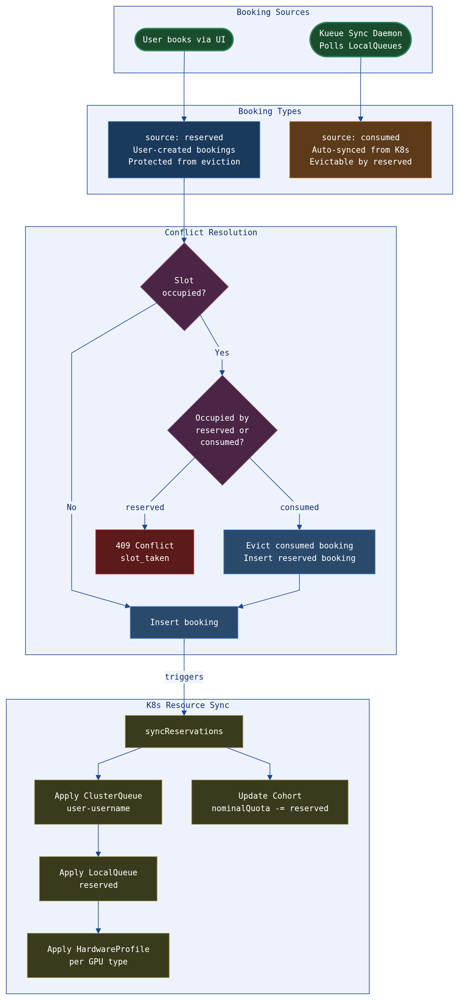
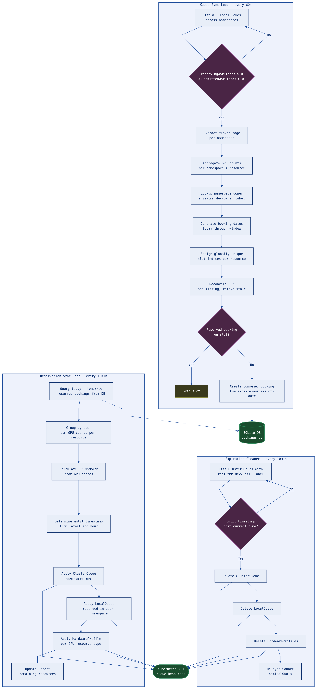

# GPU Booking App Architecture

This document describes the Kueue-based GPU reservation architecture, covering how ClusterQueues, LocalQueues, and HardwareProfiles work together to manage GPU quota allocation, preemption, and booking synchronization.

## System Overview

The GPU Booking App manages H200 GPU resources with MIG (Multi-Instance GPU) partitioning. It combines a user-facing booking system with automatic Kueue workload tracking to provide a unified view of GPU allocation.

**Key components:**
- **Booking App** (Go backend + Next.js frontend) - user-facing reservation system
- **Kueue** - Kubernetes-native job queueing with quota management
- **SQLite** - persistent booking storage
- **OpenShift OAuth Proxy** - authentication via OpenShift SSO

## GPU Resource Pool

The system manages a single H200 node with the following GPU resources:

| Resource | Count | CPU Share | CPU per Unit | Memory per Unit |
|----------|-------|-----------|-------------|-----------------|
| `nvidia.com/gpu` (Full H200) | 8 | 6.25% | 19 cores | 216 Gi |
| `nvidia.com/mig-3g.71gb` | 8 | 3.125% | 9 cores | 108 Gi |
| `nvidia.com/mig-2g.35gb` | 8 | 1.5625% | 4 cores | 54 Gi |
| `nvidia.com/mig-1g.18gb` | 16 | 0.78125% | 2 cores | 27 Gi |

**Total pool:** 316 CPU cores, 3460 Gi memory.

Each GPU resource type has a `share` value representing the fraction of total CPU/memory one unit consumes. When a user reserves N units: `cpu = floor(N * share * 316)`, `memory = floor(N * share * 3460)`.

## Kueue Resource Hierarchy

All Kueue resources share a single flat Cohort. User reservations carve out protected quota from the shared pool.



### Resource Relationships

When a user has an active reservation, three Kubernetes resources are created:

1. **ClusterQueue** (`user-<username>`) - joins the `unreserved` cohort, scoped to the user's namespace. Holds the reserved `nominalQuota` for CPU, memory, and GPU resources. Labeled with `rhai-tmm.dev/until` for expiry tracking.

2. **LocalQueue** (`reserved`) - lives in the `user-<username>` namespace and points to the user's ClusterQueue. This is the queue users submit workloads to.

3. **HardwareProfile(s)** - one per GPU resource type reserved (e.g. `reserved-gpu`, `reserved-mig-35gb`). Lives in the user's namespace and references the `reserved` LocalQueue. Provides the scheduling interface for OpenDataHub/RHOAI workbenches.

### Quota Flow

```
Total GPU Pool (values.yaml: totalResources)
    |
    |- User reservations subtracted (per-user nominalQuota)
    |
    v
Remaining = Cohort nominalQuota (shared pool)
    |
    |- ClusterQueue: unreserved (nominalQuota: 0, borrows from Cohort)
    |- ClusterQueue: unreserved-priority (nominalQuota: 0, borrows from Cohort)
    |- ClusterQueue: user-alice (nominalQuota: reserved amount)
    |- ClusterQueue: user-bob (nominalQuota: reserved amount)
```

## Preemption Model

The preemption design ensures user reservations are pre-eminent over unreserved workloads.



### Preemption Policy Summary

| Queue Type | `reclaimWithinCohort` | `borrowWithinCohort` | Effect |
|---|---|---|---|
| `user-<name>` | `Any` | `Never` | Can reclaim quota from borrowing workloads; cannot borrow beyond reservation |
| `unreserved` | (none) | (none) | Cannot preempt anyone; all workloads are borrowing |
| `unreserved-priority` | (none) | `LowerPriority` (threshold 100) | Can preempt low-priority borrowing workloads only |

**Key guarantees:**
- Workloads within a user's `nominalQuota` are **never preemptible** (they are not "borrowing")
- User CQs can **reclaim** from any workload borrowing from the Cohort (all unreserved workloads)
- Unreserved CQs **cannot preempt** user workloads because they have no reclaim policy
- Beyond their reservation, users compete fairly with no preemption rights

## Consumed vs Reserved Bookings

The system tracks two types of bookings that interact through a priority-based conflict resolution model.



### Booking Comparison

| Property | Reserved | Consumed |
|----------|----------|----------|
| **Source** | `"reserved"` | `"consumed"` |
| **Created by** | Users via booking UI | Kueue sync daemon |
| **Evictable** | No (blocks other reservations) | Yes (evicted by reserved bookings) |
| **Cancellable** | Yes (by owner or admin) | No (admin only; repopulated on next sync) |
| **ID format** | UUID | `kueue-{namespace}-{resource}-s{slot}-{date}` |
| **Triggers K8s sync** | Yes (creates ClusterQueue/LocalQueue/HardwareProfile) | No (reflects existing K8s state) |

### Conflict Resolution Rules

1. **Empty slot** - booking proceeds normally
2. **Slot occupied by `consumed`** - consumed booking is evicted, reserved booking takes its place. This reduces the unreserved Cohort and triggers Kueue workload preemption.
3. **Slot occupied by `reserved`** - returns `409 Conflict` (`slot_taken`)
4. **Database uniqueness** - `UNIQUE(resource, slot_index, date, slot_type)` constraint prevents exact duplicates

## Sync Lifecycle

Three independent sync loops run concurrently in the Go backend.



### 1. Kueue Sync Loop (every 60s)

**File:** `server/kueue.go`
**Controlled by:** `KUEUE_SYNC_ENABLED`, `KUEUE_SYNC_INTERVAL`

Polls all LocalQueues in the cluster and creates `consumed` bookings reflecting actual GPU usage:

- Lists LocalQueues via `kueue.x-k8s.io/v1beta1` API
- Filters for queues with active workloads (`reservingWorkloads > 0` or `admittedWorkloads > 0`)
- Reads `flavorUsage` to determine GPU resource counts per namespace
- Aggregates across multiple LocalQueues in the same namespace (e.g. `default`, `unreserved`, `unreserved-priority`)
- Assigns globally unique slot indices per resource to avoid UNIQUE constraint collisions
- Resolves namespace `rhai-tmm.dev/owner` label as booking owner (falls back to namespace name)
- Books from today through the rest of the week (or `KUEUE_BOOKING_DAYS` days ahead)
- Reconciles: adds missing bookings, removes stale future bookings, skips slots already reserved
- Historical bookings (past dates) are preserved

### 2. Reservation Sync Loop (every 10min)

**File:** `server/reservations.go`
**Controlled by:** Runtime toggle via `POST /api/admin/reservations`

Materializes Kueue resources (ClusterQueue, LocalQueue, HardwareProfile) for today's reserved bookings:

- Queries today's and tomorrow's `reserved` bookings from SQLite
- Groups by user, sums GPU counts per resource type
- Calculates CPU/memory allocation from GPU share ratios
- Determines `until` timestamp from the latest `end_hour`
- Applies ClusterQueue, LocalQueue, and HardwareProfile(s) via server-side apply
- Updates the `unreserved` Cohort's `nominalQuota` with remaining resources

### 3. Expiration Cleaner (every 10min)

**File:** `server/reservations.go`

Cleans up expired Kueue resources:

- Lists all ClusterQueues with the `rhai-tmm.dev/until` label
- Deletes expired ClusterQueues, their associated LocalQueues, and HardwareProfiles
- Re-syncs the Cohort `nominalQuota` after cleanup
- Also removes resources for users who no longer have active bookings (`removeStaleReservations`)

### Async Sync Triggers

In addition to the periodic loops, reservation sync is triggered asynchronously (via `go syncReservations()`) after:

- Creating a booking (`POST /api/bookings`)
- Deleting a booking (`DELETE /api/bookings`)
- Admin deleting a booking (`DELETE /api/admin`)
- Bulk booking creation (`POST /api/bookings/bulk`)
- Database import (`POST /api/admin/database/import`)

## Deployment Architecture

The application deploys as a single Kubernetes pod with three containers:

```
Pod
├── client (Next.js :3000) - frontend UI
├── server (Go :8080) - booking API + Kueue sync
└── oauth-proxy (OpenShift :4180) - SSO authentication
```

- **PVC** mounted at `/data` for SQLite storage (`bookings.db`)
- **ServiceAccount** with OAuth redirect annotation for OpenShift SSO
- **ClusterRole** RBAC for reading/writing `localqueues`, `clusterqueues`, `cohorts`, `namespaces`, and `hardwareprofiles`
- **Route** with edge TLS termination through the OAuth proxy
- User identity flows via `X-Forwarded-User` header from the OAuth proxy

## Key Files

| File | Purpose |
|------|---------|
| `server/main.go` | Booking API endpoints, conflict resolution |
| `server/kueue.go` | Kueue LocalQueue sync daemon |
| `server/reservations.go` | K8s resource sync (ClusterQueue/LocalQueue/HardwareProfile) |
| `applications/rbac/templates/reservations.yaml` | Helm template for declarative reservation resources |
| `applications/rbac/templates/kueue/_helpers.tpl` | Helm helpers for quota calculation |
| `applications/rbac/values.yaml` | Total resource pool, reservation config, flavors |
| `chart/` | Application Helm chart (deployment, PVC, RBAC, route) |
