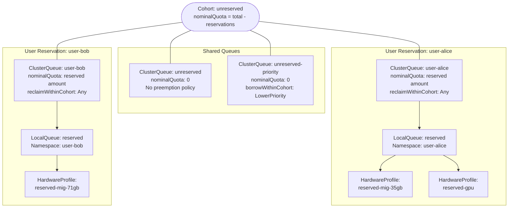
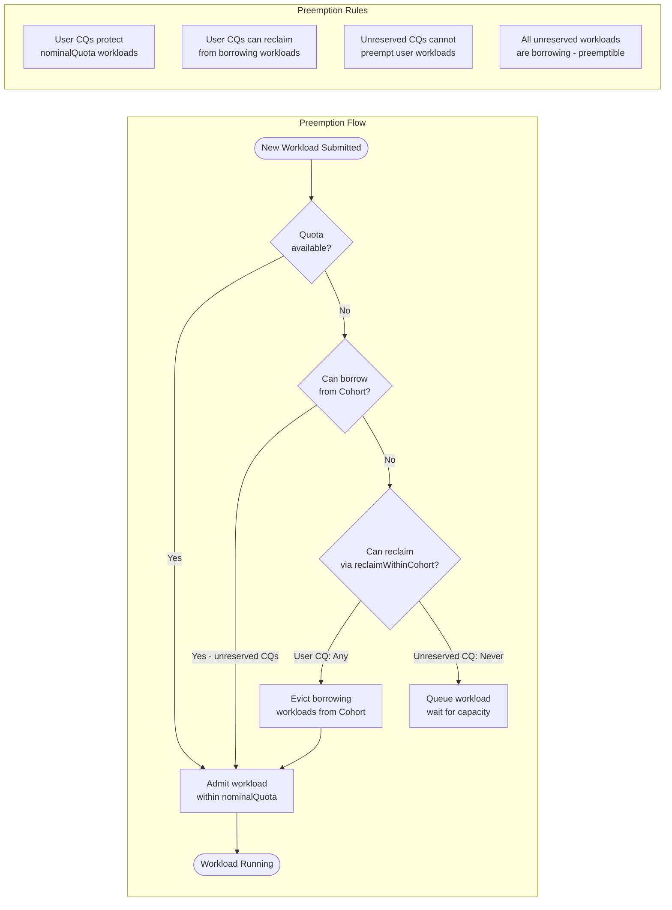
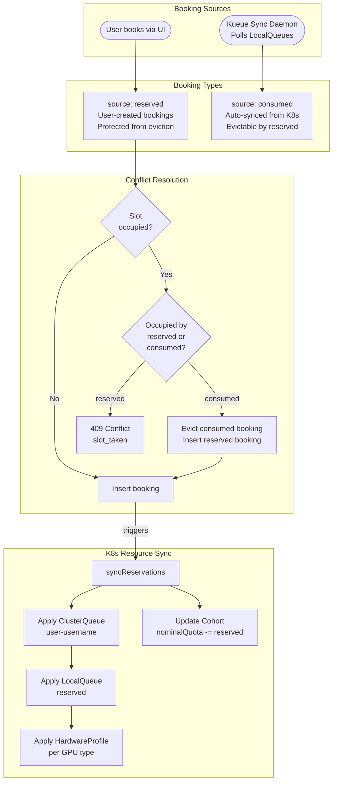
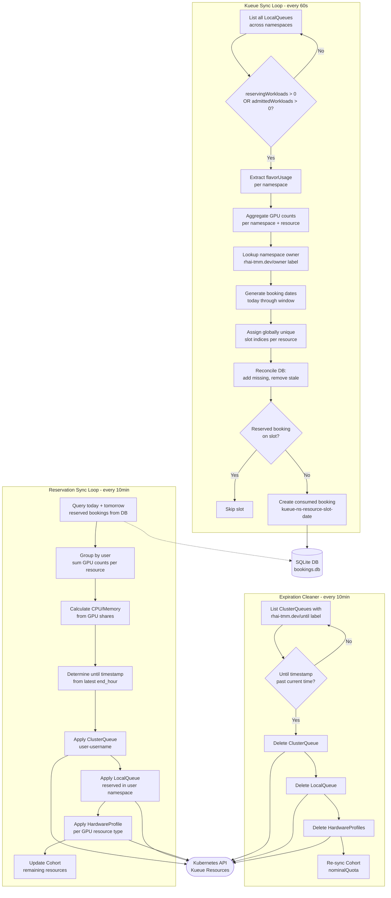

# Architecture Diagrams (Mermaid Source)

Rendered versions of these diagrams are in `ARCHITECTURE.md` using images from `images/`.

## Kueue Resource Hierarchy

## Preemption Model

## Consumed vs Reserved Booking Flow

## Sync Lifecycle

