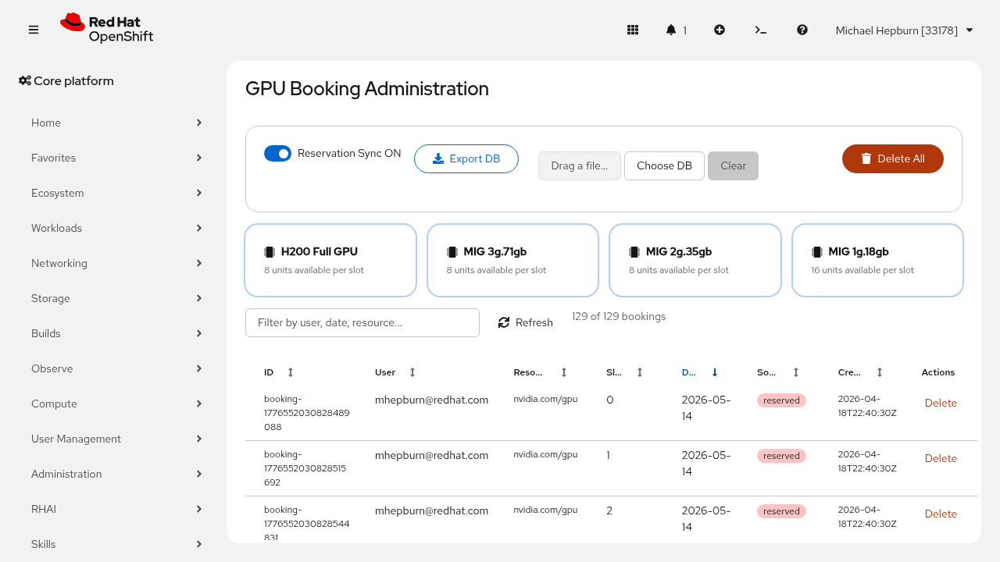
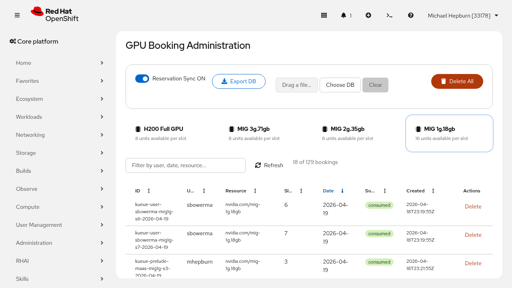
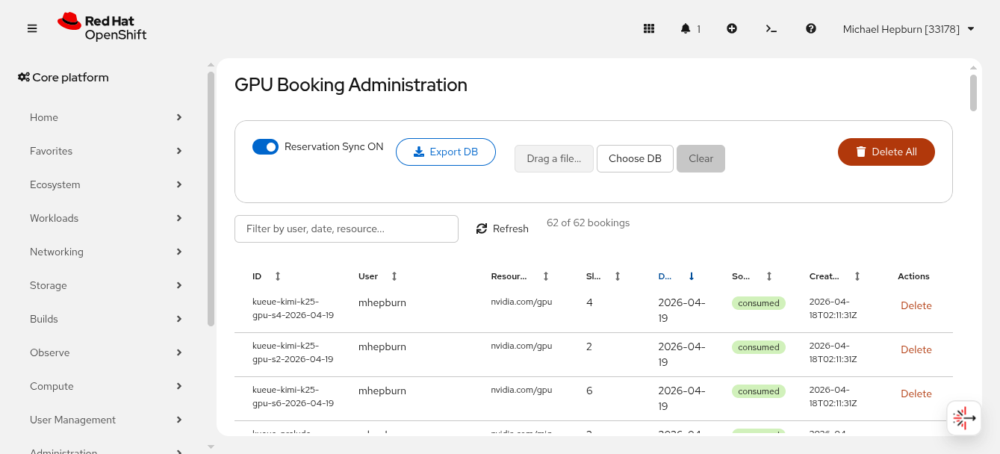
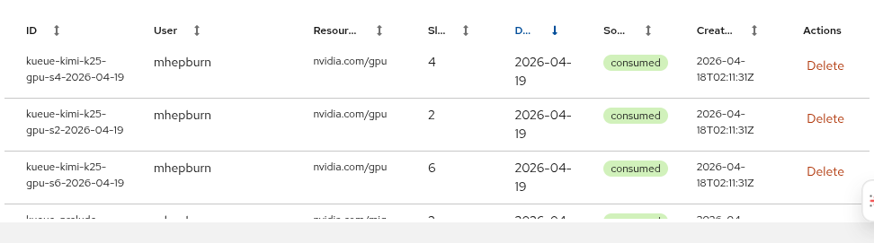

# Admin Dashboard

Topics: Admin Login, Bookings Management, Database Export/Import, Reservation Sync

---

## Overview

The admin dashboard provides a centralised view of all bookings across the cluster, with tools to manage bookings, control Kueue reservation sync, and export or import the database.

---

## Logging In

Navigate to `/admin/login` and enter the admin password. On success, a session cookie is set and you are redirected to the admin dashboard.

The admin password is configured via the `ADMIN_PASSWORD` environment variable (or `server.adminPassword` in the Helm chart).

---

## Header

The header bar shows:

- **Title and clock** -- live datetime in your browser's local timezone
- **Reservations toggle** -- green ON / red OFF button to enable or disable Kueue reservation sync at runtime without redeploying
- **Refresh** -- manually reload booking data
- **Logout** -- end the admin session

---

## Resource Filter

The resource selector cards filter the bookings table by GPU type. All resource types are selected by default. Click a card to show only that resource type; Ctrl+click (Cmd+click on Mac) to toggle individual types on or off.

The booking count updates to reflect the current filter, e.g. "18 of 129 bookings".

---

## Text Filter

The search box in the toolbar filters by ID, user, resource, date, source, or description. Filtering is case-insensitive and matches substrings. This works in combination with the resource selector above.

---

## Database Export / Import

The Database controls allow you to download a backup of the SQLite database or restore from a previous backup.

### Export

Click **Export** to download the current `bookings.db` file. The server flushes the WAL (Write-Ahead Log) before streaming the file, ensuring a consistent snapshot.

### Import

Click **Import** to upload a replacement database file. Accepted formats: `.db`, `.sqlite`, `.sqlite3` (max 100MB).

A confirmation dialog appears before the import proceeds. On success, the current database is replaced and the bookings table refreshes automatically.

  <strong>Warning</strong>
  
Importing a database replaces all existing bookings. Export a backup first if you want to preserve the current data.

---

## Bookings Table

The main table lists all bookings with sortable columns:

| Column | Description |
|--------|-------------|
| **ID** | Unique booking identifier (deterministic for Kueue bookings, random for user bookings) |
| **User** | The booking owner (OpenShift username or namespace name for Kueue bookings) |
| **Resource** | GPU resource type (e.g. `nvidia.com/gpu`, `nvidia.com/mig-1g.18gb`) |
| **Unit** | Slot index (1-based) |
| **Date** | Booking date (YYYY-MM-DD) |
| **Slot** | Always "Full Day" |
| **Source** | `reserved` (user) or `consumed` (Kueue) |
| **Hours (UTC)** | Full Day or specific hour range |
| **Description** | User-provided description or dash |
| **Created** | Timestamp when the booking was created |
| **Actions** | Delete button with confirmation |

Click any sortable column header to sort ascending; click again to reverse.

---

## Deleting Bookings

### Single Booking

Click the **Delete** button on any row. A confirmation prompt appears with **Confirm** and **Cancel** buttons. Admin can delete any booking, including consumed Kueue bookings.

### Delete All

Click **Delete All** in the table header. A confirmation prompt shows the total count. After deletion, consumed bookings will be repopulated on the next Kueue sync cycle.

---

## Reservation Sync Toggle

The **Reservations ON/OFF** button in the header controls whether the server syncs Kueue LocalQueue usage and manages per-user ClusterQueues at runtime.

- **ON** (green) -- the server polls LocalQueues, creates consumed bookings, and manages reservation ClusterQueues
- **OFF** (red) -- sync and reservation management are paused; existing bookings and ClusterQueues are not affected

This is useful for maintenance windows or debugging without needing to redeploy.

---

## Auto-Refresh

The admin dashboard automatically refreshes every 30 seconds to show the latest bookings and sync state. You can also click **Refresh** at any time.
