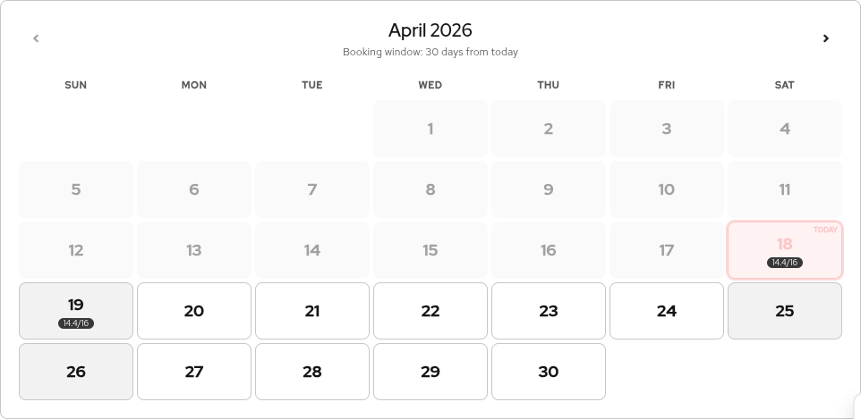
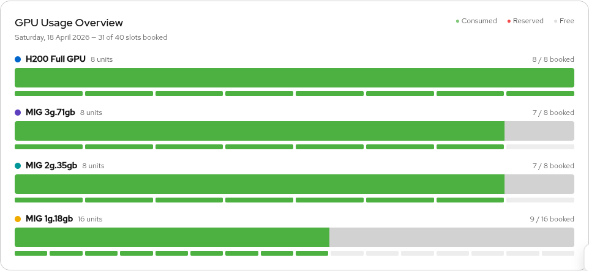
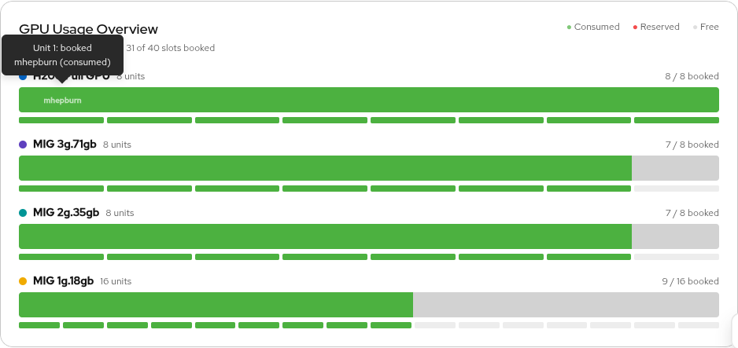

# Calendar & Navigation

Topics: Calendar, Dates, Navigation

---

## Mini Calendar

The mini calendar at the top of the main content area shows a full month grid (Sunday to Saturday). It provides a quick overview of booking activity and lets you select dates for the booking grid below.

### Today indicator

Today's date is highlighted with a **TODAY** badge and a red ring. The app always starts on the current month with today selected.

### GPU usage badges

Each day shows a small badge with the GPU equivalent usage for that day across all resource types (e.g. `4/16`). A red badge means the day is fully booked. This gives you an at-a-glance view of how busy each day is.

### Selecting dates

- **Click** a date to select it (replaces any existing selection)
- **Ctrl+click** (or Cmd+click on Mac) to toggle individual dates in a multi-selection
- **Shift+click** to select a range from the last clicked date to this one
- **Shift+Ctrl+click** to add a range to your existing selection

Selected dates are highlighted with a red ring. The booking grid below shows only the selected dates.

### Right-click context menu

Right-click on any bookable date to open a context menu with the **Book GPU** option. This opens the booking modal pre-filled with your selected date range.

### Weekend dates

Saturday and Sunday appear with a lighter background. You can still book GPU resources on weekends.

---

## Month Navigation

Use the left and right arrow buttons next to the month/year title to navigate between months.

### Booking window

You can only navigate forward within the configured booking window (default: 30 days from today). Dates beyond the window appear greyed out in the calendar and have no Reserve buttons in the grid.

### Back to today

When viewing a month other than the current one, a **Back to today** link appears. Click it to return to the current month and select today's date.

---

## My Bookings

The **My Bookings** button in the header lets you quickly find all your reservations:

1. Click **My Bookings** to select all dates where you have reserved bookings and navigate to the earliest month
2. The button highlights red while active
3. Click **My Bookings** again (or click any calendar date) to deselect and return to today

This is useful when you have bookings spread across multiple dates or months and want to review them all at once.

---

## GPU Usage Overview

The GPU Usage Overview panel shows a visual breakdown for the selected date.

### Stacked bars

Each resource type has a horizontal bar showing:

| Colour | Meaning |
|--------|---------|
| Red | Reserved bookings (user-created) |
| Green | Consumed bookings (auto-synced from Kueue workloads) |
| Light grey | Free / available |

### Per-unit dots

Below each bar, individual dots represent each GPU unit. Hover over a dot to see who has booked that specific unit.

### Selecting a date

Click a date in the mini calendar to update the GPU Usage Overview for that day.

### Timezone-aware "today" view

When your local date differs from the UTC date (e.g. it is April 8 in GMT+10 but still April 7 in UTC), the GPU Usage Overview automatically includes bookings from **both dates**. This ensures you see all relevant bookings, including those created by users in other timezones. The subtitle shows both dates when this is active.

---

## Next Steps

- [Making Bookings](making-bookings) -- reserve and cancel GPU slots
- [Slot Types & Conflicts](slots-and-conflicts) -- understand how booking conflicts work
