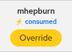

# Kueue & Auto-Bookings

Topics: Kueue, LocalQueue, Auto-sync

---

## What is Kueue?

Kueue is a Kubernetes-native job queueing system that manages GPU quota and workload scheduling on the cluster. It controls which workloads run, when, and on what resources.

The booking app integrates with Kueue to show real-time GPU usage and prevent double-booking of resources that are actively in use.

---

## Auto-Bookings

A background sync process polls all LocalQueues in the cluster and automatically creates bookings based on active GPU usage.

### How it works

1. The sync process checks all LocalQueues every 60 seconds (configurable)
2. For queues with active workloads, it reads the `flavorUsage` to determine GPU resource counts
3. It creates bookings for each GPU resource type in use
4. Bookings cover from today through the rest of the current week (or a configurable number of days ahead)

### Identifying consumed bookings

Kueue auto-bookings are visually distinct in the booking grid:

| Indicator | Meaning |
|-----------|---------|
| Lightning bolt label | This slot was auto-booked by Kueue (consumed) |
| Amber **Override** button | Click to replace with your reserved booking |
| Namespace/owner name | Shows which project is using the resource |

The owner is resolved from the namespace's `rhai-tmm.dev/owner` label, falling back to the namespace name.

### Consumed bookings in the GPU Usage Overview

In the stacked bar chart, consumed bookings appear in **green** while reserved bookings appear in **red**. This gives you a quick visual of how much capacity is used by active workloads vs. user reservations.

---

## Reserved vs. Consumed Priority

Reserved bookings **always take priority** over consumed bookings:

- If you reserve a slot that has a consumed auto-booking, the consumed booking is automatically evicted
- Your reserved booking proceeds and a Kueue reservation is created for your quota
- The displaced workload may be preempted by Kueue to free up the resource
- Only reserved-vs-reserved conflicts return a `slot_taken` error

This means you can always guarantee access to a GPU resource by making a reservation, even if the resource is currently in use.

  <strong>Impact on running workloads</strong>
  
Overriding a consumed booking may cause a running workload to be preempted. The workload will be re-queued and can resume when resources become available. Consider whether the workload owner needs to be notified.

---

## Sync Lifecycle

### Booking creation

- Auto-bookings have `source: "consumed"` (user bookings have `source: "reserved"`)
- Each auto-booking has a deterministic ID: `kueue-{namespace}-{resource}-s{slot}-{date}`
- Bookings are created for today through the end of the current week
- On Sunday, bookings extend through the following Sunday

### Reconciliation

Each sync cycle:

1. **Adds** bookings for newly detected workloads
2. **Removes** stale future bookings for workloads that have completed
3. **Skips** slots that already have a reserved booking (reserved takes priority)
4. **Preserves** historical bookings (past dates are never removed)

### Cancellation rules

- Normal users **cannot cancel** consumed auto-bookings (returns `consumed_booking` error)
- Users can **override** consumed bookings by clicking the Override button, which replaces the auto-booking with a reserved one
- Administrators can delete any booking, including consumed ones
- If an admin deletes a consumed booking, it will be recreated on the next sync cycle if the workload is still active

---

## Preempted Workloads

When a reserved booking displaces a consumed booking, Kueue may preempt the affected workload. The booking page shows a collapsible **preempted workloads** banner between the GPU Usage Overview and the calendar whenever preemptions are active.

### What the banner shows

The banner displays a warning icon with a count (e.g. "2 preempted workloads"). Click to expand and see details for each preempted workload:

| Field | Description |
|-------|-------------|
| **Reason** | The preemption reason label (e.g. `Preempted`, `InClusterQueue`) |
| **Owner** | The user whose workload was preempted (resolved from namespace labels) |
| **Namespace/Name** | The Kubernetes namespace and Workload object name |
| **Message** | The full preemption message from Kueue, including the UID of the workload that triggered the preemption |
| **Timestamp** | When the preemption occurred |

### How preemption conditions work

Kueue adds two conditions to a preempted Workload's `.status.conditions`:

- **Evicted** (reason: `Preempted`) -- indicates the workload was evicted due to preemption
- **Preempted** (reason: `InClusterQueue`) -- provides details about why the preemption occurred

The banner polls for preempted workloads every 30 seconds and hides automatically when there are none.

### What to do about preempted workloads

A preempted workload is re-queued by Kueue and will resume when resources become available. If you see your own workloads listed:

- Check whether you still need the preempted workload to run
- Wait for resources to free up, or adjust your resource requests
- Contact the user who made the reservation if urgent

---

## Next Steps

- [Making Bookings](making-bookings) -- how to override consumed bookings
- [Slot Types & Conflicts](slots-and-conflicts) -- booking conflict rules
- [FAQ](faq) -- common questions
