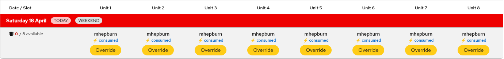

# Slot Types & Conflicts

Topics: Slots, Hours, Conflicts, Rules

---

## Booking Slots

Each booking occupies a slot defined by the combination of resource type, unit index (slot), and date. All bookings use a single "full" slot type -- there are no separate AM/PM slot types.

### Hour ranges

Bookings can optionally specify a start and end hour (in UTC). When no hours are specified, the booking covers the full day (00:00 to 00:00 next day).

| Booking type | Hours (UTC) | Description |
|-------------|-------------|-------------|
| Full day | 00:00 -- 00:00 +1d | Entire day (default) |
| Custom hours | e.g. 14:00 -- 22:00 | Specific hour range |

Hours are entered in local timezone in the booking modal and converted to UTC for storage. The grid shows UTC hours on bookings with custom ranges.

  <strong>Timezone handling</strong>
  
The booking modal shows hours in your browser's local timezone with the UTC equivalent displayed below. The backend stores and processes all hours in UTC.

---

## Conflict Rules

The system enforces uniqueness per resource + unit + date to prevent double-booking:

### Database constraint

The underlying database has a UNIQUE constraint on:

- Resource type (e.g., `nvidia.com/gpu`)
- Slot index (unit number)
- Date
- Slot type (always `"full"`)

This guarantees that two users cannot book the exact same unit on the same date, even in the rare case of simultaneous requests.

### Reserved vs. consumed priority

When a conflict exists between a reserved (user) booking and a consumed (Kueue) booking:

- **Reserved always wins** -- the consumed booking is automatically evicted
- Only **reserved-vs-reserved** conflicts return a `slot_taken` error
- The bulk booking endpoint auto-finds available slot indices and handles eviction automatically

### Visual indicators

- **Reserve** button -- the slot is available, click to book
- **Your username** -- you have booked this slot (hover for Edit/Cancel options)
- **Another username** -- someone else has booked this slot
- **Lightning bolt + Override** -- consumed auto-booking, can be overridden

---

## Booking Expiry

Bookings have hour-aware expiry times based on the `end_hour` field:

| Booking type | Expires at (UTC) |
|-------------|-----------------|
| Full day (end_hour=24) | 00:00 UTC the following day |
| Custom hours (e.g. end_hour=18) | 18:00 UTC on the booking date |

When a user has multiple bookings on the same day, the reservation's `rhai-tmm.dev/until` label uses the latest `end_hour` across all their bookings.

Once a booking expires, the associated Kubernetes reservation resources (ClusterQueue, LocalQueue, HardwareProfile) are cleaned up automatically by the reservation cleaner (runs every 10 minutes).

---

## Next Steps

- [Making Bookings](making-bookings) -- reserve and cancel slots
- [GPU Resources](gpu-resources) -- available resource types
- [FAQ](faq) -- common questions
